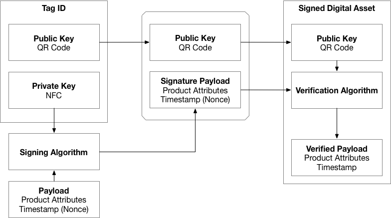

# Title: Tamperproof NFC Product Authentication System using Blockchain (Tag ID)
### Inventor: Terence D. Pae

#### Field of Invention
This invention relates to a method which allows physical product attribution to the digital assets in the Blockchain. Particularly, this invention ensures exactly one-to-one existence (1 physical product and 1 digital asset) and utilizes tamperproof mechanisms, both physically and digitally. This invention is applicable to allow products to be authenticated, in order to prevent counterfeits and lock dependency between the physical and digital realm.

### Background of Invention
In the modern society, there are value regards to the authenticity of the product. Meaning, there are service providers that will charge a fee to verify whether the product is legit. The issue lies in what happens after the authentication process, it requires a seal of authentication in a physical form, and the issuer may or may not have a record of the authenticated product. The product relies on the physical seal of authentication and may require additional verification in order to verify the authenticity of the seal. Products can change ownership, and the means of verifying the authenticity of the product can become non-trivial, where the physical seal of authentication can easily be misplaced, or difficult to verify legitimacy.

In the modern distributed computing technology, Blockchain has the means to keep a record of physical products, in a form of the decentralized ledger, in a form of non-fungible digital asset. However, the problem lies where the digital asset may hold the information of the product, but does not have the means to verify the authenticity. For example, an issued digital asset may have authenticity value in the digital realm, but when associating the digital asset to the physical product, it is impossible to assert that physical product will always remain authentic, given that a replacement with a counterfeit can occur at any given time.

### Summary of the Invention

In order to verify the authenticity of the product between the digital and physical realm, we need to satisfy the following requirements:

 - Ensure one-to-one existence (1 digital asset, and 1 physical product)
 - Tamperproof seal to ensure the product has not changed
 - Fast product verification to ensure seamless transactions
 - Tightly coupled dependency between digital and physical product

Tag IDs are NFC-powered tamperproof tags, which can be attached physically to the product, where it will be impossible to remove without breaking the tamperproof seal. If the seal is broken, then from a verification perspective, the transaction will be invalid, and verifying the authenticity is no longer possible.

Tag ID will work together with Signed Digital Asset to create a two-factor authentication system for the products, ensuring that tag is not compromised digitally (through elliptic-curve cryptography), and also physically (tamperproof seals).

Combined with Tag ID and Signed Digital Asset will represent verified seal of authentication and will guarantee one-to-one existence with the digital asset and the physical product.

#### Two-Factor Authentication with Tag ID
When working with public key cryptography used in Bitcoin, also known as elliptic-curve cryptography, there exists a method to create key derivatives (https://github.com/bitcoin/bips/blob/master/bip-0032.mediawiki#specification-key-derivation). Key derivatives are useful when creating keys that are verifiable to single origin, securely and effectively.

Tag IDs will have two components:
 - QR Code representation of derived child public key (Tag ID public key)
 - NFC containing derived child private key (Tag ID private key)

Tag ID will have similar features as a wallet, able to sign payloads with a public key. The signed payload (unique to the product) will be used to verify the authenticity of the product recorded in the blockchain.

#### Product Authentication
In order to create a Signed Digital Asset, one of the requirements is to associate a signed payload from the Tag ID, with the following:
 - Product Attributes
 - Timestamp (Nonce)

The Tag ID public key, signed payload, along with product attributes, will be recorded in the blockchain as the Signed Digital Asset. Signed payloads can be used by the owner of the product to verify the authenticity of the product.

A nonce is an arbitrary number that can be used just once. It is similar in spirit to a nonce word, hence the name. It is often a random or pseudo-random number issued in an authentication protocol to ensure that old communications cannot be reused in replay attacks.

#### Product Verification
The Signed Digital Asset will contain unique Tag ID public key, which will be used to find and verify the ownership of the product. From a Signed Digital Asset, the owner can verify the signed payload using Tag ID's private key, and if verification is successful, then associated signed digital asset is verified with the physical product.

Product authenticity verification is only possible with Tag ID since it will have the private key in NFC. By allowing verification possible only through the private key in NFC, it will create a digital dependency on the physical product.

If the Tag ID or product is lost, then there's no way to verify the product. Tag ID will always be required to verify the authenticity, creating the physical dependency on the signed digital asset.
