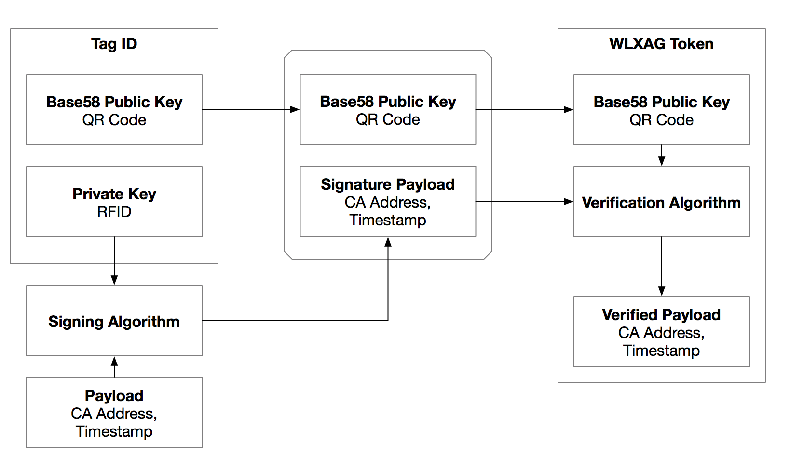

# WLX Coin

## ERC20 - Distributable Token

WLX Coins will be issued according to [ERC20](https://github.com/ethereum/EIPs/issues/20) Standard, which has all the necessary components required to have a successful token distribution. `ERC20` also enables us to interface with other existing `ERC20` Tokens, providing flexibility where it's required.

## ERC865 - Delegated Transfers

We will implement experimental features from [ERC865](https://github.com/ethereum/EIPs/issues/865), which allows delegated transfers that help facilitate token transfers without needing gas. The orders are triggered on off-chain relays, which will execute our smart contract with signed verifiable payload, and will transfer tokens from source to target destination.

In order to increase the adoption of our Coins through our mobile app, `ERC865` will reduce the barrier of entry of our users. They will not be required to purchase or own ether, but they will be required to use our WLX Wallet App.

Our WLX Wallet App will be a customized Ethereum wallet, which will have the functionality to sign delegated transfers and trigger off-chain relay to be executed on the blockchain.

### 0x Protocol

Delegated transfers requires a delegate account, which is required to have access to a pool of ETH to facilitate the trade. We can interface with [0x Protocol](https://0xproject.com/), which will allow us to execute trades through smart contract, interfacing with our DApp to automate the exchange end-to-end.

Several optimizations are necessary to create seamless exchange interaction, the price of WLX will be marginally higher to use on our Wallet App versus standard exchanges.

### End-to-End Transaction with Only WLX Coins

Using `ERC865` features, we can successfully execute end-to-end transactions without having users to use gas.

1. `User A` to send `1 WLX` to `User B`
2. `User A` executes off-chain function `transferPreSigned` on `Delegate`
3. `Delegate` verifies `signedPayload` from `User A`
4. `Delegate` executes transfer of `WLX (fee)` from `User A` to `User B` with gas from `DelegateAccount`
5. `Delegate` executes `trade` of `fee` on `0xProtocolExchange` for `ETH` to `DelegateAccount`
6. `DelegateAccount` is replenished for additional transactions

The `fee` will need to be calculated (WLX <> ETH value) prior to executing `transferPreSigned` and should be enough to cover gas price of 2 separate transactions needed to create end-to-end transaction.

# WLXAG Token

Whoslux Ecosystem will require interactions with two different tokens, WLX coin is necessary to facilitate the transfer of value across the platform, and WLXAG token is necessary to create transferrable object that represents the Authenticated Good.

## ERC721 - Non-Fungible Token

WLXAG token will be issued according to `ERC721` Standards for Non-Fungible Tokens, with attributes assigned to each token to represent ownership, Network Authenticator address, Tag ID, [IPFS](https://ipfs.io/) address to hold assets and additional metadata.

## Tamperproof RFID Tag Authentication System (Tag ID), Patent Pending

Each WLXAG token will be associated with Tamperproof RFID Tag Authentication System (Tag ID), which will serve as two-factor authentication when verifying the product.

In order to verify the authenticity of the product between digital and physical realm, we need to satisfy the following requirements:
 - Ensure one-to-one existence (1 WLXAG token, and 1 physical product)
 - Tamperproof seal to ensure product has not changed
 - Fast product verification to ensure seamless transactions
 - Tightly coupled dependency between digital and physical product

Tag IDs are RFID-powered tamperproof tags, which can be attached physically to the product, where it will be impossible to remove without breaking the tamperproof seal. If the seal is broken, then from verification perspective, the transaction will be invalid.

Tag ID will work together with WLXAG token to create a two-factor authentication for the products, ensuring that tag is not compromised digitally (elliptic-curve cryptography), and also physically (tamperproof seals).

Each Tag ID will represent verified seal of authentication, and will guarantee one-to-one existence with the token and the product.

### Two-Factor Authentication with Tag ID

When working with public key cryptography used in Bitcoin, also known as elliptic-curve cryptography, there exists a method to create key derivatives (https://github.com/bitcoin/bips/blob/master/bip-0032.mediawiki#specification-key-derivation). Key derivatives are useful when creating keys that are verifiable to single origin, securely and effectively.

Tag IDs will have two components:
 - QR Code representation of derived child public key in base58 format (Tag ID public key)
 - RFID containing derived child private key (Tag ID private key)

Tag ID will have similar features as a wallet, able to sign payloads with a public key. The signed payload (unique to the product) will be used to verify authenticity of the product recorded in the blockchain.

#### Product Authentication

In order to create WLXAG token, one of the requirements is to associate a signed payload from the Tag ID, with the following attributes:
 - Authentication timestamp
 - Network authenticator address
 - Nonce

The Tag ID public key, signed payload, along with other product attributes, will be recorded in the blockchain to create WLXAG token. The signed payload can be used by the owner of the product to verify the authenticity of the product.

#### Product Verification



WLXAG token will contain unique Tag ID public key, which will be used to find and verify the ownership of the product. From WLXAG, owner can verify the signed payload using Tag ID private key, and if verification is successful, then associated WLXAG token is verified with the physical product.

Product authenticity verification is only possible with Tag ID, since it will have the private key in RFID. By allowing verification possible only through the private key in RFID, it will create a digital dependency to the physical product.

If the Tag ID or product is lost, then there's no way to verify the product. Tag ID will always be required to verify the authenticity, creating physical dependency to the digital WLX token.

## Network Authenticators

Each WLXAG Token is issued by the Network Authenticator (NA). NA's primary objective is to authenticate the goods, in exchange for a fee in WLX.

### Decentralized Autonomous Organization (DAO)

NAs will operate under DAO, with rules defined during the creation of the NA. NAs will have the ability to add/remove members, change authentication consensus, set fee price, and payment distribution amongst members.

NAs can also define validation rules, which will be used to filter incoming authentication requests.

### Issuing WLXAG Tokens

NAs will interface with `Authenticator Smart Contract`, which contains all of necessary functions to issue WLXAG Tokens using WLX Coin.

#### Authenticator Smart Contract

The Authenticator Smart Contract utilizes P2P-based authentication system based on photo recognition and consensus voting system. The authentication process will require Tag ID to be registered, and therefore Tag ID is a requirement for authentication. When a user wants to authenticate the goods, they will send WLX as fees, signed Tag ID payload, and product metadata, which will available for verification by the NAs.

Authenticator Smart Contract will create an address in IPFS, where user can upload assets and verifiable proofs for NAs to use for authentication.

```
  - For Each Goods (to be authenticated)
    - Authenticate Goods that Pass Initial Validation Criteria (Owner Address, Authentication Fee in WLX, Signed Tag ID payload, NA Address, IPFS Address, Product Attributes)
    - NA Members
      - Approve Authentication (Pre-authenticated Goods Address)
      - Reject Authentication (Pre-authenticated Goods Address)
  - Approved Authenticated Goods (Reaches Pre-defined Consensus)
    - Issue WLXAG Token (Owner Address, Signed Tag ID payload, NA Address, IPFS Address, Product Attributes)
    - Distribute Fees to NA Members (NA Address, WLX)
  - Reject Authenticated Goods
    - Issue Partial Refund of Fees (Owner Address, WLX)
```

## Token Features

WLXAG tokens are non-fungible in nature. They have an authentication authority (NAs), which issues a seal of authentication that is freely interchangeable among users.

Blockchain also introduces immutability and transparency, with open ledger support for every transaction. WLXAG tokens offer trust to both parties (buyer and seller) in a transaction, as long as both parties can agree to trust NAs issuing the token. WLXAG Tokens also provide traceability, can follow history of transactions to further verify it's authenticity.

WLXAG tokens have Tag ID associations, creating physical hard dependency for transactions. WLXAG tokens cannot be used without the Tag ID (product), and product cannot be used in the ecosystem without the WLXAG token.

### Trading

WLXAG Tokens can be traded across the platform, and each token represent a authentication seal for the physical goods. WLXAG Tokens can interface with `Marketplace Smart Contract` which provides features for facilitating safe trading.

#### Marketplace Smart Contract

The Marketplace Smart Contract contains features that allows trading on the platform. Marketplace Smart Contract helps facilitate safe trading, with several features to protect both the buyer and the seller.

The basis of the smart contract revolves around a simple feature to transfer ownership.

```
  - Transfer Ownership (WLXAG, Signed Tag ID payload, Recipient Address)
```

##### Selling a Product

```
  - Selling a Product
    - [Seller] Make product available for sale to a user (WLXAG, Buyer Address, Price of Goods in WLX)
    - [Buyer] Pays for product, funds are held in escrow (WLXAG, WLX)
    - [Seller] Ships the product to buyer
    - [Buyer] Verify received the product (WLXAG, Signed Tag ID payload)
    - [Seller] receives payment from buyer
```
